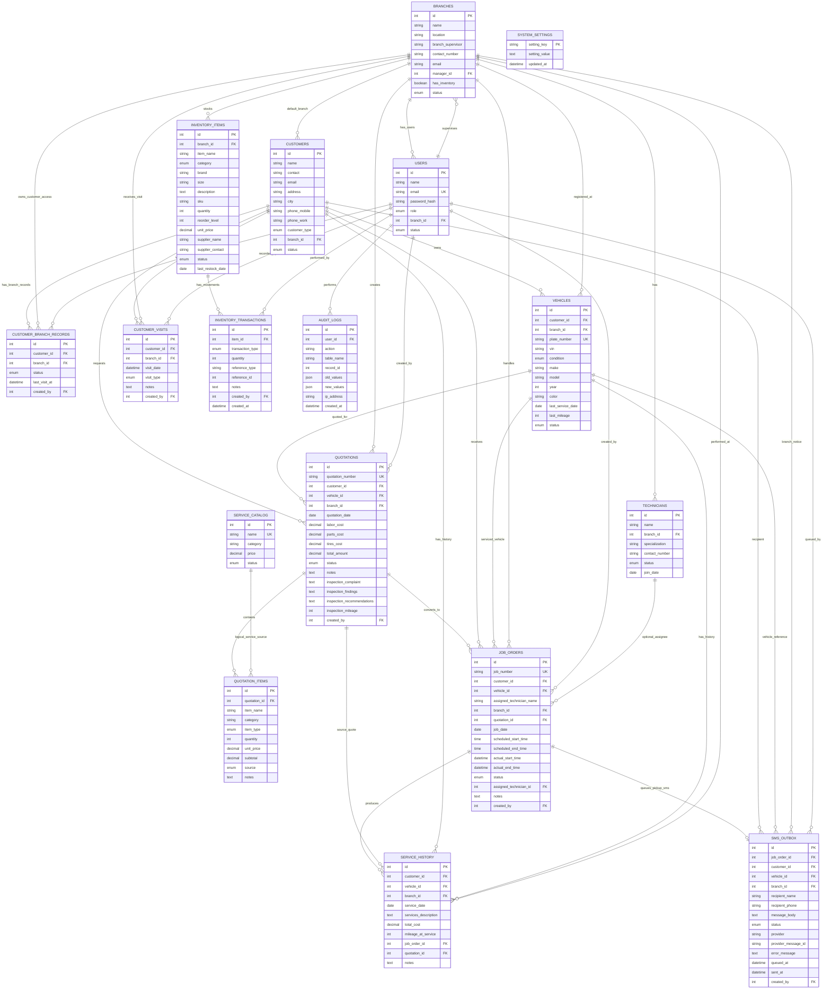
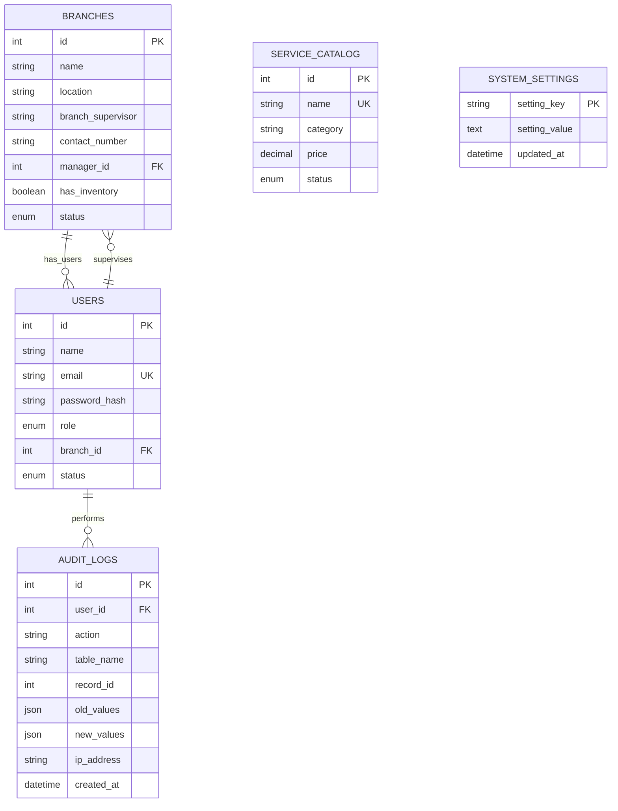
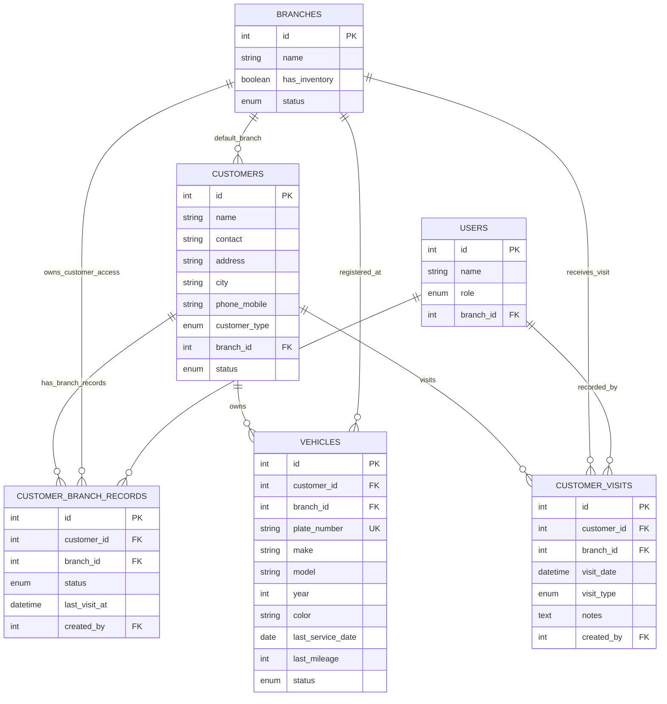
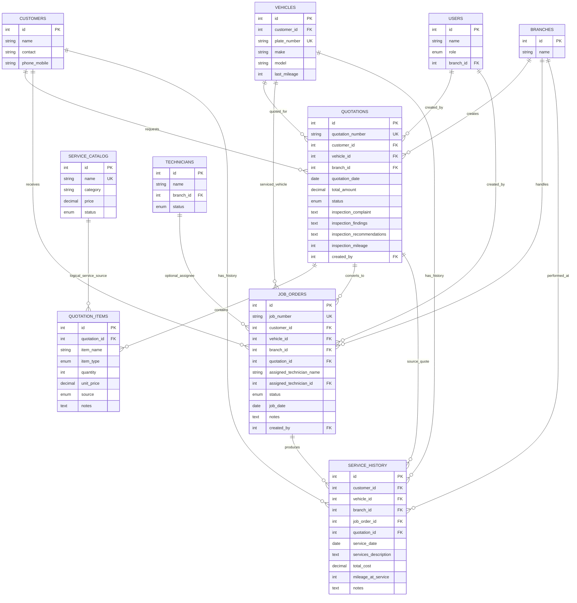
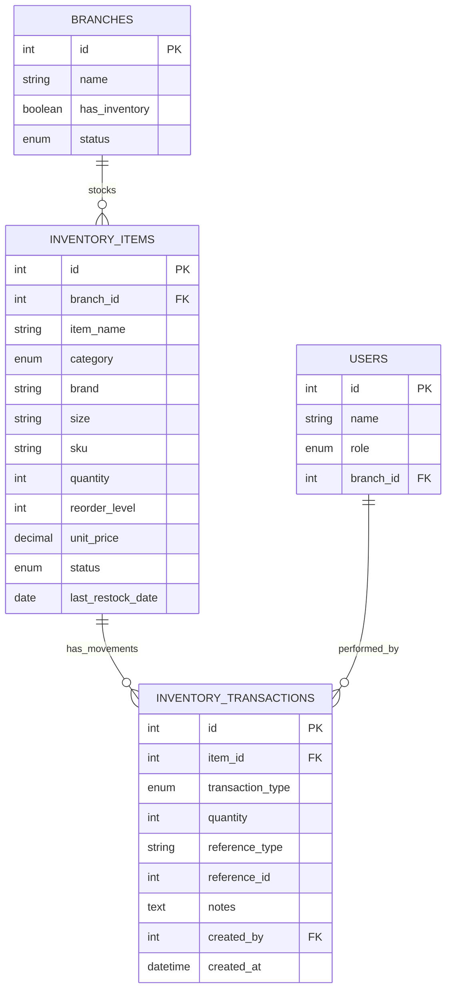
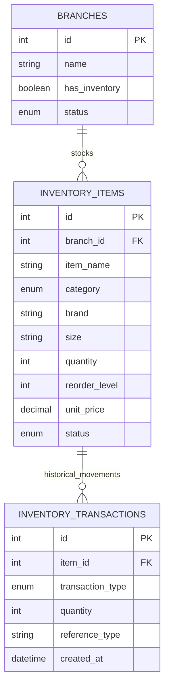
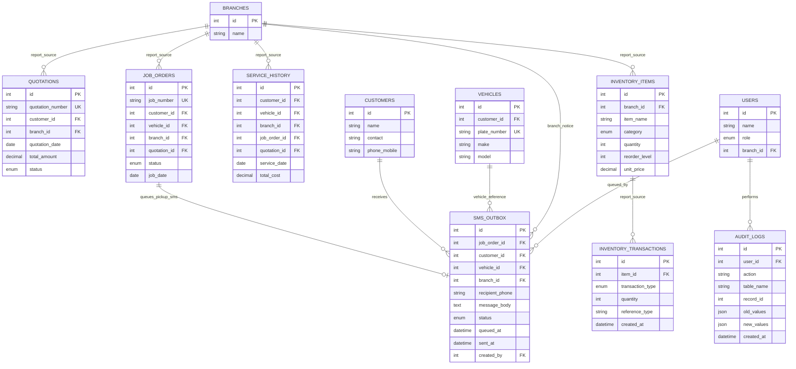

# Highway Tires ERD Mermaid Diagrams

Paste one Mermaid block at a time into draw.io:

`Insert` -> `Advanced` -> `Mermaid`

The whole-system ERD is large. If draw.io becomes crowded, use the module ERDs instead.

## Whole System ERD

## Module 1: Access And System Maintenance

## Module 2: Customer And Vehicle Records

## Module 3: Service Operations

## Module 4: Inventory Management

## Module 5: Forecasting And Decision Support

Forecasting is computed from inventory tables. It does not have a separate physical forecasting table.

## Module 6: Reports, Notifications, And Audit

