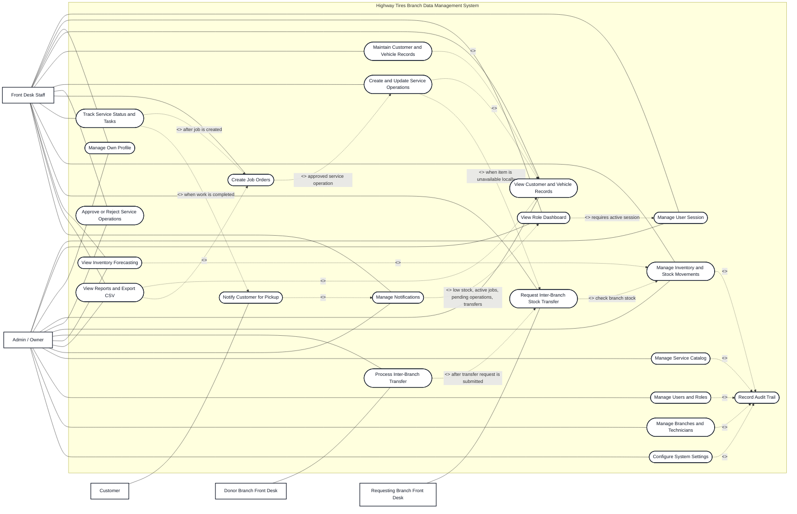

# HW Tires System Use Case Diagram

Updated: August 26, 2026

Paste the Mermaid block below into a Mermaid previewer or draw.io using `Insert > Advanced > Mermaid`.

## Actor Summary

| Actor | Role in the system |
| --- | --- |
| Admin / Owner | Monitors branches, views records, manages inventory visibility, reports, forecasting, notifications, users, branches, services, and settings. |
| Front Desk Staff | Handles branch operations such as customers, vehicles, service operations, job orders, service status, inventory actions, reports, forecasting, and notifications. |
| Requesting Branch Front Desk | Requests inventory from another branch when a service operation needs an unavailable item. |
| Donor Branch Front Desk | Reviews, approves, and completes transfer requests from its branch inventory. |
| Customer | Receives pickup notification when a job order is completed. |

## Main Constraints

- Protected use cases require an active logged-in user.
- Front desk changes are limited to the user's assigned branch.
- Admin-only maintenance includes service catalog, user roles, branches, technicians, and system settings.
- Service operations can create inter-branch transfer requests when selected items are sourced from another branch.
- Completed job orders generate service history and trigger customer pickup notification handling.
