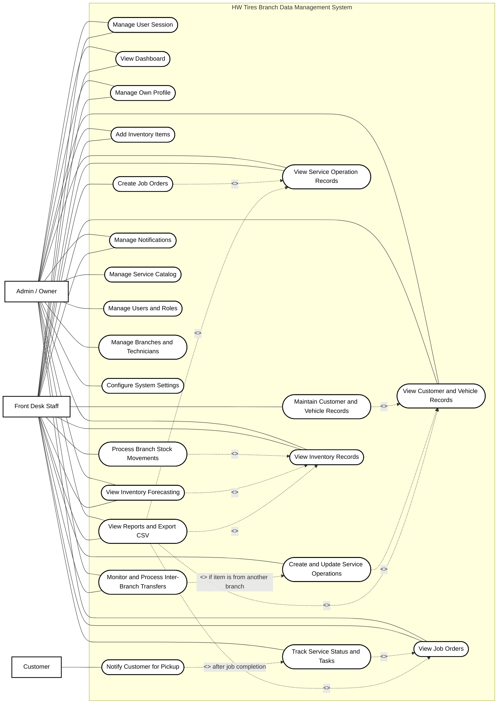
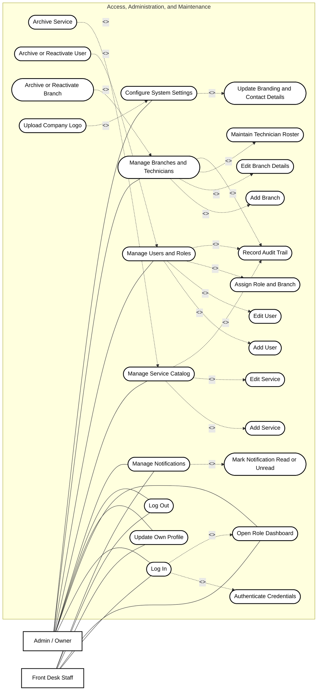
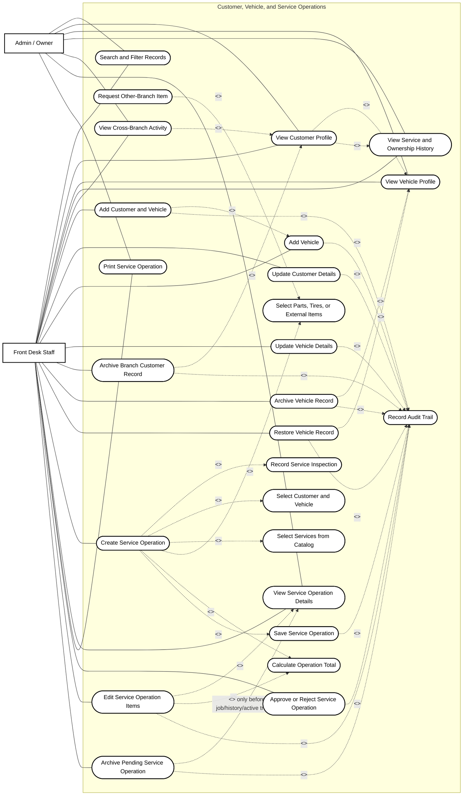
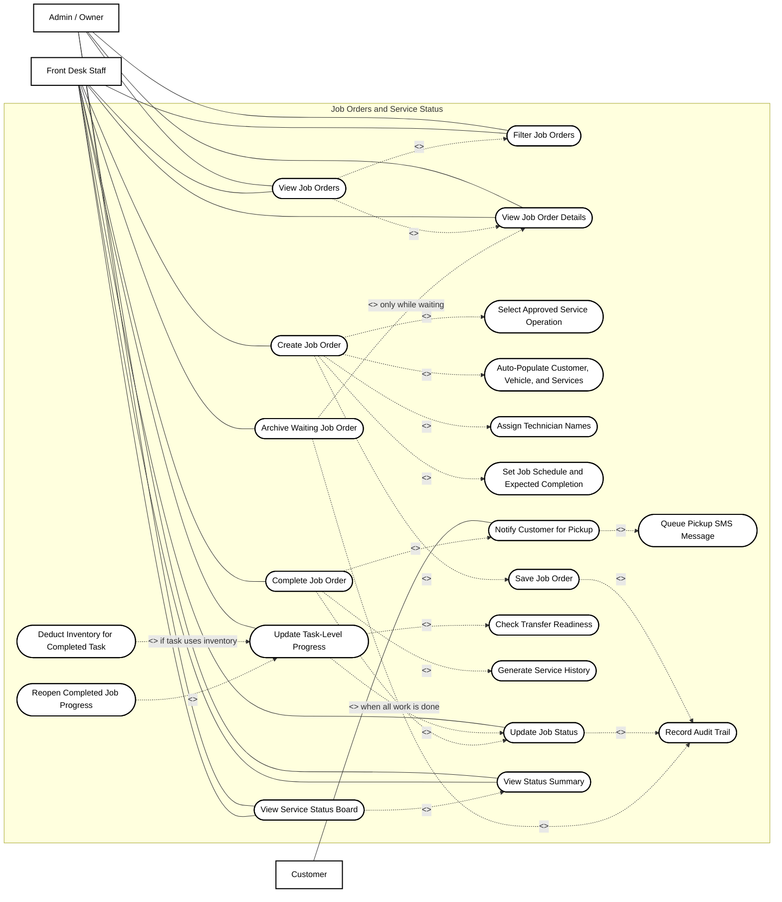
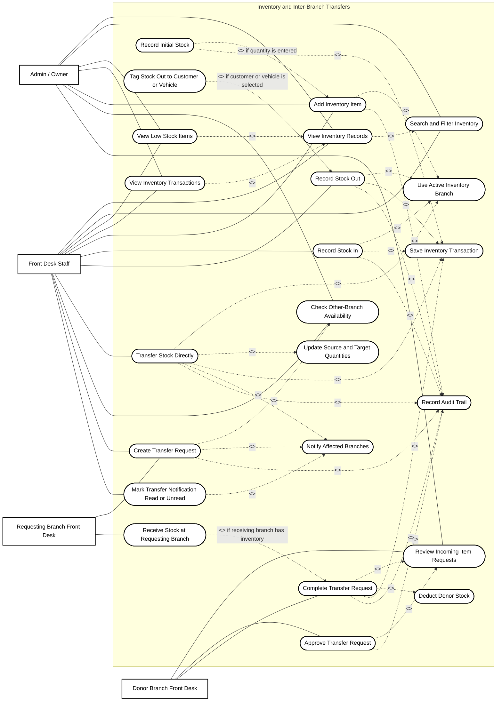
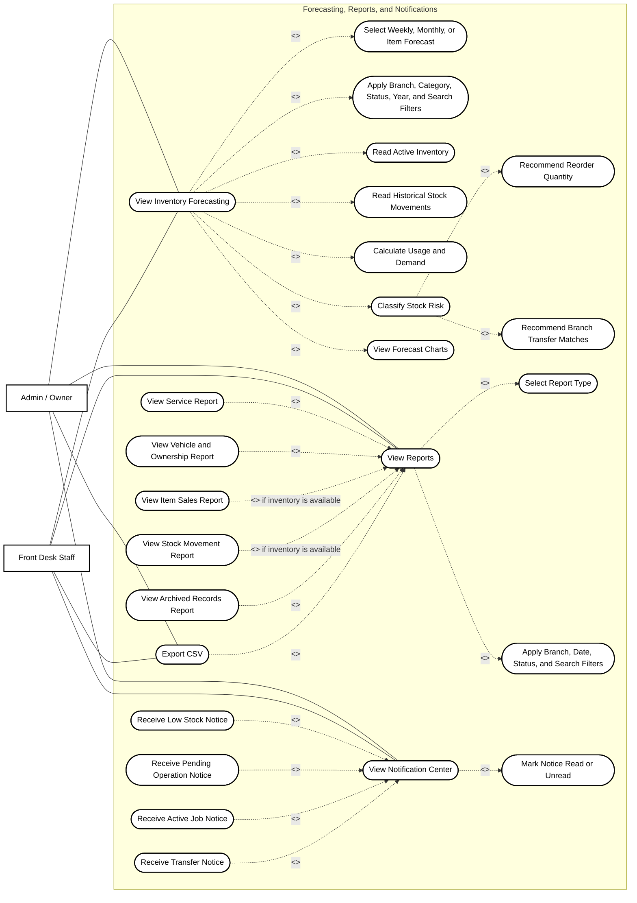

# HW Tires Use Case Diagram

Updated: August 25, 2026

These diagrams document the current HW Tires Branch Data Management System as Mermaid flowcharts that follow UML use case diagram conventions as closely as Mermaid allows.

## UML Rules Applied

- Actors are outside the system boundary.
- Use cases are inside the system boundary and are named with verb-object phrases.
- Solid lines show actor participation.
- `<<include>>` points from a base use case to mandatory reused behavior.
- `<<extend>>` points from optional or conditional behavior back to the base use case it extends.
- Database tables, UI widgets, and internal implementation details are not modeled as actors.
- Authentication and branch authorization are treated as preconditions for protected use cases.
- Admin/Owner operational pages are modeled as monitoring or view-only where the code enforces branch Front Desk changes.

## Whole System Use Case

## Access, Administration, and Maintenance

## Customer, Vehicle, and Service Operations

## Job Orders and Service Status

## Inventory and Inter-Branch Transfers

## Forecasting, Reports, and Notifications

## Actor Access Summary

| Actor | Main responsibilities |
| --- | --- |
| Admin / Owner | Monitors all branches, views operational records, adds inventory items, manages services, users, branches, technician rosters, settings, forecasting, reports, and notifications. |
| Front Desk Staff | Creates and maintains branch records, service operations, job orders, service progress, inventory movements, branch transfers, forecasting views, reports, and notifications within branch access rules. |
| Donor Branch Front Desk | Reviews incoming stock requests and completes transfer requests from its own inventory branch. |
| Requesting Branch Front Desk | Requests items from another branch and receives transfer completion updates. |
| Customer | Receives pickup SMS notification when a job order is completed and a phone number is available. |

## Important Constraints

- Protected use cases require a logged-in active user.
- Front Desk record changes are limited to the user's assigned branch.
- Admin/Owner can view operational records across branches, but current customer, service operation, job order, and stock movement handlers keep day-to-day operational changes with Front Desk users.
- Service operation archiving is allowed only before linked job orders, service history, or non-pending transfer requests exist.
- Job order archiving is allowed only while the job order is still waiting.
- Completing a job order generates service history and queues a pickup SMS message.
- Other-branch service items may create transfer requests and block task completion until the needed item has been transferred.
